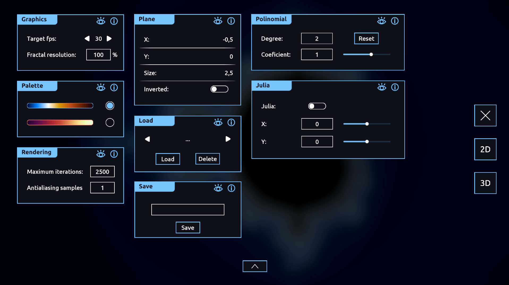

# Fractals
 2D and 3D fractal rendering program.

 The main goal of this project is to redesign the user interface for the fractal rendering program i made for highschool when i learnt about complex numbers (see `Screenshots/Old/` if you want to know how it looked back then)

## Disclaimer
This fractal rendering program is well optimized. However, enabling high-quality settings can result in a VERY SIGNIFICANT GPU usage.

## 2D
### Achieved results

