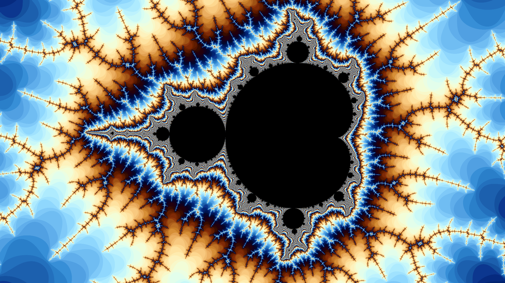

# Fractals
2D and 3D Fractal Rendering Program made with Unity

The main goal of this project is to redesign the user interface for the fractal rendering program I made in high school when I learned about complex numbers (see `Screenshots/Old/` if you want to know how it looked back then).

## Disclaimer
This fractal rendering program is well optimized. However, enabling high-quality settings can result in a VERY SIGNIFICANT GPU usage.

## 2D
### Achieved Results

### Rendering

The fractals are rendered with a compute shader. Unfortunately only Windows supports double precision floating point numbers so you'll have less quality on the other platforms.

The fractals are defined with the following series:

$$ f_0 = z $$

$$ f_n = p(f_{n-1}) + f_0 $$

where `p` is a polynomial (with a default value of `p(x) = x^2`) and `z` is a point on the complex plane.

If you enable Julia, the equation will be replaced with the following:

$$ f_0 = z $$

$$ f_n = p(f_{n-1}) + c $$

where `c` is a constant equal for all of the points.

The program calculates how many iterations you need to apply to diverge to infinity (you can change the default value of the maximum number of iterations to calculate that).

You can also specify the number of samples used to color each pixel. Be VERY CAREFUL when changing this parameter because it multiplies the WHOLE rendering time by n. It can lead to MASSIVE GPU usage and even cause the program to close due to making VERY EXPENSIVE dispatches on the graphics card. So, if you are just experimenting with different fractal configurations that you are unsure will render smoothly, it SHOULD HAVE a value of 1.

# TO DO
 - Include the 3D fractals